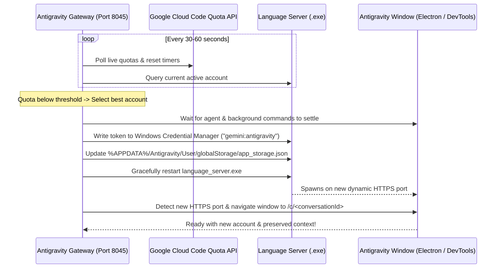

<p align="center">
  
</p>

<h1 align="center">Antigravity Gateway & Smart Shield</h1>

<p align="center">
  <b>Multi-Account Load Balancer, Quota Shield & Parallel Harness for Google Antigravity</b><br>
  Keep <a href="https://antigravity.google">Google Antigravity</a> running smoothly across multiple Google AI Pro accounts.<br>
  Switch accounts <b>before</b> quota runs out, <b>between</b> tasks, without losing your active conversation or context.
</p>

<p align="center">
  
  
  
  
  
</p>

---

## 🌟 Key Features

- **Cross-Platform Support**: Native, first-class support for both **Windows 10/11** and **macOS**.
- **1-Click Automated Setup**:
  - `install.bat` on Windows sets up everything in seconds.
  - Automatically detects Antigravity installation path and Windows OS version.
  - Automatically extracts official Google Antigravity OAuth client credentials directly from `language_server.exe` — **no Google Cloud Console project or OAuth consent screen needed!**
  - Auto-imports currently active Antigravity account from Windows Credential Manager (`gemini:antigravity`) or macOS Keychain into the pool.
  - Automatically creates a Desktop shortcut (`Antigravity Gateway.lnk`).
- **Post-Update Self-Healing & Diagnostic (`repair-after-update.bat`)**:
  - When Google Antigravity updates itself, running the repair tool automatically re-locates binaries, re-syncs OAuth credentials, verifies Credential Manager tokens, and cleanly restarts the gateway.
- **Smart Quota Shield**:
  - Live quota tracking (weekly & 5-hour buckets for Gemini Pro, Flash, Claude, and Imagen 3).
  - Rotates accounts intelligently before quota is exhausted.
  - Grace period awareness: avoids unnecessary restarts if the quota window resets within 15 minutes.
- **Context & Conversation Preservation**:
  - Seamlessly re-attaches to the exact conversation (`/c/<conversation-id>`) in the Antigravity window via local DevTools debugging.
  - Overcomes the language server port reassignment issue on Windows by proactively navigating cross-port HTTPS endpoints.
- **Safe Task Scheduling**:
  - Waits until agent responses, tool executions, and background commands finish before switching accounts.
- **Silent Background Execution**:
  - Completely hidden background execution via `run-background.vbs` or the interactive `start.bat` control panel.
- **Zero Runtime Dependencies**: Built purely with native Node.js (`node:sqlite`, `fetch`, `WebSocket`, `node:crypto`).

---

## 🚀 Quick Start (Windows)

### 1. One-Click Installation

1. Clone or download this repository:
   ```cmd
   git clone https://github.com/YOUR_USERNAME/Antigravity-Gateway.git
   cd Antigravity-Gateway
   ```
2. Double-click **`install.bat`** (or run `npm run setup` in your terminal).
   - The installer verifies Node.js (v22+ required).
   - Auto-extracts Antigravity's official OAuth credentials into `oauth-client.json`.
   - Imports your logged-in Antigravity account into `accounts.json`.
   - Creates an **Antigravity Gateway** desktop shortcut.

### 2. Running & Managing the Gateway

- **Desktop Shortcut**: Double-click the shortcut to start the gateway in the background.
- **Interactive Control Menu (`start.bat`)**:
  - `[1]` Run in Background (Silent, recommended)
  - `[2]` Run in Foreground (Inspect live logs and debug output)
  - `[3]` Open Dashboard (`http://127.0.0.1:8045`)
  - `[4]` Stop Gateway
- **Stop Gateway**: Double-click `stop.bat` to terminate running background instances.

### 3. Adding More Accounts to the Pool

1. Open the dashboard at **http://127.0.0.1:8045**.
2. Click **Add Account**.
3. Sign in to your secondary Google account in the browser.
4. The account and its quota limits will automatically appear in your pool.

### 4. Post-Update Self-Repair (`repair-after-update.bat`)

Whenever Google Antigravity receives an automatic update:
- Double-click **`repair-after-update.bat`** (or run `npm run repair`).
- It validates binary paths, re-extracts tokens, cleans zombie sockets, and restarts the background service.

---

## 🍏 Quick Start (macOS)

```bash
git clone https://github.com/YOUR_USERNAME/Antigravity-Gateway.git
cd Antigravity-Gateway
npm run setup
npm start
```
Open **http://127.0.0.1:8045** in your browser. To keep it running persistently, you can use [PM2](https://pm2.keymetrics.io/):
```bash
pm2 start src/server.js --name antigravity-gateway
pm2 save
```

---

## 🧠 Architecture & Windows Port Details



### Windows-Specific Engineering Highlights:
- **Windows Credential Manager Integration (`scripts/wincred.ps1`)**: Native P/Invoke via `Advapi32.dll` (`CredWriteW` / `CredReadW`) eliminates `cmdkey.exe`'s 512-character limit and avoids external compiled binaries.
- **Cross-Port Reconnection**: When Antigravity's supervisor restarts `language_server.exe`, it assigns a new ephemeral HTTPS port. The gateway probes for the new port and redirects DevTools proactively, preventing UI freeze or blank screens.
- **Portability**: All launch scripts use relative paths and UTF-8 encoding (`chcp 65001`), supporting non-ASCII directory paths.

---

## ⚙️ Configuration & Smart Shield Settings

All settings can be configured via the web UI at `http://127.0.0.1:8045`:

| Setting | Default | Description |
|---|---|---|
| **Weekly / 5h Threshold** | `20%` / `20%` | Percentage remaining before rotating to next account |
| **Watch Limits Of** | Auto | Gemini, Claude/GPT, both, or current active conversation model |
| **Main Account** | None | Preferred default account to return to once quotas recover |
| **Auto-Continue** | Off | Automatically sends "continue" after switching from a quota limit |
| **Auto-Switch** | On | Enables automated Smart Shield background rotation |

---

## 🛠️ API Reference

| Endpoint | Method | Purpose |
|---|---|---|
| `/api/stats` | GET | Status of all accounts, quotas, and OS environment |
| `/api/ide-status` | GET | Currently active Antigravity account & pending switch queue |
| `/api/set-active-account` | POST | Manually switch active account (`?id=<account_id>`) |
| `/api/config/smart-shield` | GET/POST | Read or update Smart Shield rotation parameters |
| `/api/ide-focus` | POST | Focus specific conversation in IDE window (`?id=<conversation_id>`) |
| `/v1/chat/completions` | POST | OpenAI-compatible proxy endpoint |
| `/v1/messages` | POST | Anthropic-compatible proxy endpoint |

---

## 🧪 Testing

The test suite runs with Node.js built-in test runner without external dependencies:

```bash
npm test
```

37 tests covering account rotation, Smart Shield thresholds, token formatting, active session detection, and layout preservation.

---

## 🇮🇷 راهنمای فارسی (Persian Guide)

این پروژه نسخه توسعه‌یافته و پورت‌شده‌ی **Antigravity Gateway** برای سیستم‌عامل **ویندوز** و مک است که امکان استفاده‌ی همزمان و بدون وقفه از چند اکانت گوگل پرو (Google AI Pro) را در نرم‌افزار **Google Antigravity** فراهم می‌کند.

### ویژگی‌های کلیدی:
1. **نصب آسان با یک کلیک (`install.bat`)**:
   - نیازی به ساخت پروژه در گوگل کلاد کنسول یا وارد کردن دستی Client ID نیست؛ اسکریپت به صورت خودکار اطلاعات مجاز را از خود باینری نرم‌افزار استخراج می‌کند.
   - اکانت لاگین‌شده‌ی فعلی شما را به طور خودکار به لیست اضافه می‌کند.
   - شورتکات روی دسکتاپ ایجاد می‌کند.
2. **رفع باگ گیر کردن سوییچ در ویندوز**:
   - پورت‌های متغیر نرم‌افزار و بازنشانی صفحه گفتگو را به طور هوشمند مدیریت کرده و مانع از گیر کردن برنامه یا نیاز به ری‌استارت دستی می‌شود.
3. **ابزار تعمیر بعد از آپدیت (`repair-after-update.bat`)**:
   - در صورت آپدیت شدن نرم‌افزار Antigravity توسط گوگل، تنها با اجرای این فایل، تمام مسیرها، توکن‌ها و پورت‌ها به طور خودکار عیب‌یابی و اصلاح می‌شوند.
4. **اجرا در پس‌زمینه (Background)**:
   - با استفاده از فایل `run-background.vbs` یا منوی `start.bat` برنامه به شکل کاملاً مخفی و بدون اشغال صفحه در پس‌زمینه اجرا می‌شود.

---

## 📄 License

MIT License. See [LICENSE](LICENSE) for details.
