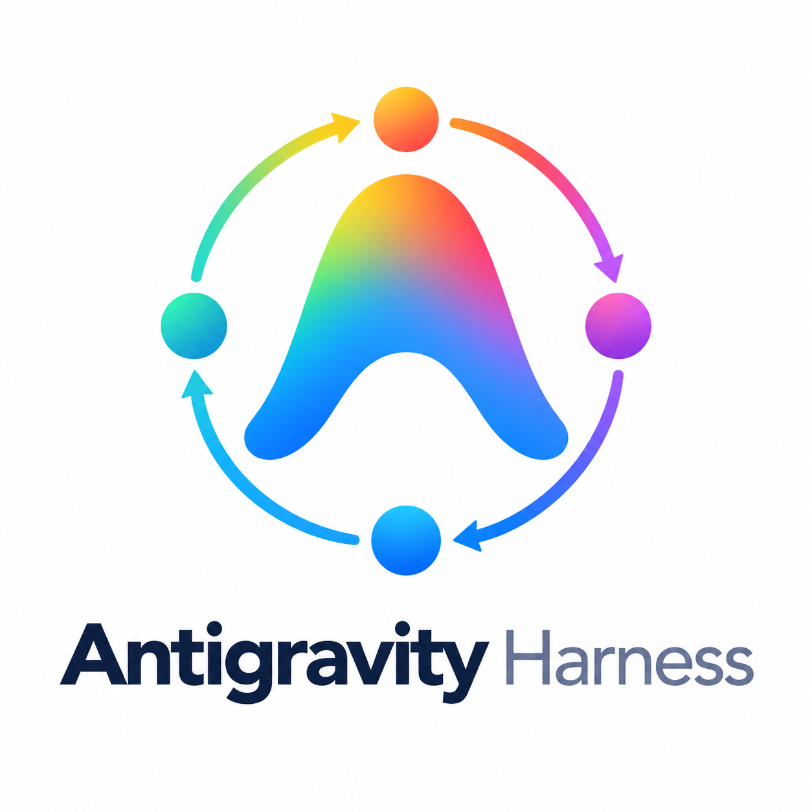
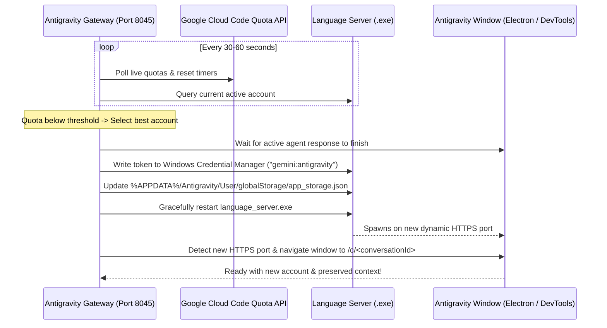

<p align="center">
  
</p>

<h1 align="center">Antigravity Gateway & Smart Shield</h1>

<p align="center">
  <b>Multi-Account Load Balancer, Quota Shield & Context-Preserving Switcher for Google Antigravity</b><br>
  Keep <a href="https://antigravity.google">Google Antigravity</a> running smoothly across multiple Google AI Pro accounts.<br>
  Switch accounts <b>before</b> quota runs out, <b>between</b> tasks, without losing your active conversation or context.
</p>

<p align="center">
  <a href="https://github.com/tahakhorsand/Antigravity-Gateway-for-windows/blob/Antigravity-Gateway-for-windows/LICENSE"></a>
  <a href="https://nodejs.org"></a>
  
  
  
</p>

---

## 🌟 Key Features

- **Native Windows Support**: Tailored specifically for Windows 10/11 (with macOS support preserved).
- **1-Click Automated Setup (`install.bat`)**:
  - Automatically verifies Node.js 22+.
  - Automatically discovers the Google Antigravity installation directory.
  - Automatically extracts official Google Antigravity OAuth client credentials directly from `language_server.exe` — **no Google Cloud Console project or OAuth consent screen needed!**
  - Automatically imports your currently logged-in Antigravity account from Windows Credential Manager (`gemini:antigravity`).
  - Automatically creates a desktop shortcut (`Antigravity Gateway.lnk`).
- **Zero Runtime Dependencies**: Built entirely using native Node.js 22+ modules (`node:sqlite`, `fetch`, `WebSocket`, `node:crypto`). No `npm install` hassles or third-party package vulnerabilities.
- **Smart Quota Shield**:
  - Live quota tracking (weekly & 5-hour buckets for Gemini Pro, Flash, Claude 3.5/3.7, and Imagen).
  - Rotates accounts intelligently before quota is exhausted.
  - Grace period awareness: avoids unnecessary restarts if the quota window resets within 15 minutes.
- **Context & Conversation Preservation**:
  - Seamlessly re-attaches to the exact active conversation (`/c/<conversation-id>`) in the Antigravity window via local DevTools debugging.
  - Handles dynamic language server port changes cleanly on Windows, preventing blank screens or IDE freezes.
- **Post-Update Self-Healing (`repair-after-update.bat`)**:
  - Whenever Google Antigravity auto-updates, running this tool automatically re-locates binaries, re-syncs OAuth credentials, clears stale socket locks, and restarts the gateway.
- **Silent Background Execution**:
  - Completely hidden background execution via `run-background.vbs` or the interactive `start.bat` menu.

---

## 📋 Prerequisites

1. **Google Antigravity**: Must be installed on your computer, and you should be logged into at least one Google account inside Antigravity.
2. **Node.js 22 or higher**:
   - Antigravity Gateway requires Node.js v22+ because it uses the built-in `node:sqlite` database and modern web APIs without requiring any external npm dependencies.
   - **How to install Node.js**:
     - **Option A (Installer)**: Download and run the installer from [https://nodejs.org](https://nodejs.org) (LTS or Current, version 22+).
     - **Option B (PowerShell / Windows Terminal)**:
       ```powershell
       winget install OpenJS.NodeJS.LTS
       ```
   - Verify installation by opening Command Prompt or PowerShell and running:
     ```cmd
     node -v
     ```
     *(Make sure it displays `v22.x.x` or higher)*

---

## 🚀 Installation & Quick Start (Windows)

### Step 1: Download the Project

Choose either method:

- **Method A (Easiest - Direct Download)**:
  1. Click the green **Code** button at the top of this GitHub page and click **Download ZIP** (or [Click Here to Download ZIP](https://github.com/tahakhorsand/Antigravity-Gateway-for-windows/archive/refs/heads/Antigravity-Gateway-for-windows.zip)).
  2. Extract the downloaded ZIP file to any folder on your computer (for example: `C:\Antigravity-Gateway-for-windows`).
  3. Open the extracted folder.

- **Method B (Using Git)**:
  ```cmd
  git clone https://github.com/tahakhorsand/Antigravity-Gateway-for-windows.git
  cd Antigravity-Gateway-for-windows
  ```

---

### Step 2: One-Click Installation

Double-click **`install.bat`** inside the folder.

The installer will automatically:
1. Verify your Node.js version.
2. Locate Google Antigravity and extract the official OAuth credentials from `language_server.exe`.
3. Import your current logged-in Antigravity account into `accounts.json`.
4. Create an **Antigravity Gateway** shortcut directly on your Desktop.
5. Offer to launch the gateway immediately!

---

### Step 3: Running the Gateway

You can launch the gateway at any time using:
- **Desktop Shortcut**: Double-click the **Antigravity Gateway** shortcut on your Desktop.
- **Launcher Menu (`start.bat`)**:
  - `[1] Run in Background (Silent, Recommended)`: Runs completely hidden in the background without keeping a command prompt window open.
  - `[2] Run in Foreground`: Displays live logs and real-time debug output.
  - `[3] Open Dashboard in Browser`: Opens `http://127.0.0.1:8045`.
  - `[4] Stop Gateway`: Shuts down the background gateway process.

Once started, the Web Dashboard automatically opens at **http://127.0.0.1:8045**.

---

### Step 4: Adding Additional Google Accounts

1. Open the dashboard at **http://127.0.0.1:8045**.
2. Click the **Add Account** button in the top right.
3. A Google OAuth sign-in page will open in your browser. Log in with your secondary Google account.
4. Once completed, the new account and its live quotas (5-hour and weekly limits) will appear in your pool.
5. Repeat for as many accounts as you want!

---

### Step 5: Working with Google Antigravity

**You don't need to do anything manual!**
- Open Google Antigravity and prompt normally.
- The Smart Shield monitors your remaining quotas in the background.
- When an account's quota drops below the threshold (or runs out), the gateway automatically switches to the next healthiest account in your pool.
- Your active conversation (`/c/...`), window layout, and context are automatically preserved without any interruption.

---

### 🛑 Stopping the Gateway

To stop the background gateway at any time, double-click **`stop.bat`** (or choose Option 4 in `start.bat`).

---

### 🔧 Post-Update Self-Repair (`repair-after-update.bat`)

Whenever Google releases an automatic update for Antigravity:
1. Double-click **`repair-after-update.bat`**.
2. The repair tool re-detects updated executable paths, re-syncs OAuth credentials, clears stale socket locks, and restarts the gateway.

---

## 🍏 Quick Start (macOS)

```bash
git clone https://github.com/tahakhorsand/Antigravity-Gateway-for-windows.git
cd Antigravity-Gateway-for-windows
node scripts/setup.js
node src/server.js
```

Open **http://127.0.0.1:8045** in your browser. To run continuously in the background on macOS:
```bash
npx pm2 start src/server.js --name antigravity-gateway
npx pm2 save
```

---

## 🧠 Architecture & Windows Details



### Windows-Specific Engineering Highlights:
- **Windows Credential Manager Integration (`scripts/wincred.ps1`)**: Direct P/Invoke via Windows native `Advapi32.dll` (`CredWriteW` / `CredReadW`) bypasses `cmdkey.exe`'s 512-character token truncation limit and avoids requiring compiled C++ binaries.
- **Dynamic Cross-Port Reconnection**: When Antigravity restarts `language_server.exe`, an ephemeral HTTPS port is assigned. The gateway detects the new port and redirects DevTools proactively, preventing UI freeze.
- **Zero Runtime Dependencies**: Runs entirely on Node.js 22+ built-in modules (`node:sqlite`, `crypto`, `http`, `WebSocket`).

---

## ⚙️ Configuration & Smart Shield Settings

All settings can be configured via the web UI at `http://127.0.0.1:8045`:

| Setting | Default | Description |
|---|---|---|
| **Weekly / 5h Threshold** | `20%` / `20%` | Percentage remaining before rotating to next account |
| **Watch Limits Of** | Auto | Gemini, Claude/GPT, both, or current active conversation model |
| **Main Account** | None | Preferred default account to return to once quotas recover |
| **Auto-Continue** | Off | Automatically sends "continue" after switching from a quota limit |
| **Auto-Switch** | On | Enables automated Smart Shield background rotation |

---

## 🛠️ API Reference

| Endpoint | Method | Purpose |
|---|---|---|
| `/api/stats` | GET | Status of all accounts, quotas, and OS environment |
| `/api/ide-status` | GET | Currently active Antigravity account & pending switch queue |
| `/api/set-active-account` | POST | Manually switch active account (`?id=<account_id>`) |
| `/api/config/smart-shield` | GET/POST | Read or update Smart Shield rotation parameters |
| `/api/ide-focus` | POST | Focus specific conversation in IDE window (`?id=<conversation_id>`) |
| `/v1/chat/completions` | POST | OpenAI-compatible proxy endpoint |
| `/v1/messages` | POST | Anthropic-compatible proxy endpoint |

---

## 🧪 Testing

The test suite runs with Node.js built-in test runner without external dependencies:

```bash
node --test src/*.test.js
```

37 tests covering account rotation, Smart Shield thresholds, token formatting, active session detection, and layout preservation.

---

## 🇮🇷 راهنمای جامع فارسی (Persian Guide)

این پروژه نسخه سفارشی‌سازی‌شده و پایدار **Antigravity Gateway** مخصوص **ویندوز ۱۰ و ۱۱** (و مک) است. با این ابزار می‌توانید چندین اکانت گوگل (دارای اشتراک Google AI Pro یا عادی) را به صورت همزمان متصل کنید تا نرم‌افزار **Google Antigravity** بدون توقف کار کند. این ابزار قبل از تمام شدن سهمیه (Quota) ۵ ساعته یا هفتگی، اکانت را به صورت خودکار تغییر می‌دهد و چت و کانتکست فعال شما محفوظ می‌ماند.

### ۱. پیش‌نیازها
1. **نصب بودن نرم‌افزار Google Antigravity**: باید برنامه روی سیستم نصب باشد و حداقل با یک اکانت وارد آن شده باشید.
2. **نصب بودن Node.js نسخه ۲۲ یا بالاتر**:
   - این پروژه نیاز به هیچ پکیج اضافی (npm install) ندارد و تماماً با ماژول‌های داخلی Node.js 22 (نظیر دیتابیس داخلی SQLite) اجرا می‌شود.
   - برای نصب، به سایت [nodejs.org](https://nodejs.org) مراجعه کنید یا در محیط PowerShell دستور زیر را اجرا نمایید:
     ```powershell
     winget install OpenJS.NodeJS.LTS
     ```
   - برای اطمینان از نصب بودن، در ترمینال بنویسید: `node -v` (باید نسخه‌ای مثل `v22.x.x` نمایش داده شود).

---

### ۲. مراحل نصب و راه‌اندازی (سریع و آسان)

#### گام اول: دانلود پروژه
- **ساده‌ترین روش (بدون نیاز به گیت)**:
  1. روی دکمه سبز رنگ **Code** در بالای همین صفحه گیت‌هاب کلیک کرده و گزینه **Download ZIP** را انتخاب کنید (یا [اینجا کلیک کنید](https://github.com/tahakhorsand/Antigravity-Gateway-for-windows/archive/refs/heads/Antigravity-Gateway-for-windows.zip)).
  2. فایل فشرده را در هر مسیری که مایلید (مثلاً در یک پوشه داخل درایو C یا دسکتاپ) Extract کنید.
- **یا با دستور گیت**:
  ```cmd
  git clone https://github.com/tahakhorsand/Antigravity-Gateway-for-windows.git
  cd Antigravity-Gateway-for-windows
  ```

#### گام دوم: اجرای فایل نصب
- کافیست روی فایل **`install.bat`** دوبار کلیک کنید.
- نصاب خودکار کارهای زیر را انجام می‌دهد:
  - نسخه Node.js را بررسی می‌کند.
  - مسیر نرم‌افزار Antigravity را پیدا کرده و کلیدهای ارتباطی مجاز را به طور خودکار استخراج می‌کند (**هیچ نیازی به ساخت پروژه در کنسول گوگل یا تعریف Client ID ندارید**).
  - اکانت گوگل فعلی شما را از Credential Manager ویندوز می‌خواند و ثبت می‌کند.
  - یک شورتکات به نام **Antigravity Gateway** روی دسکتاپ شما می‌سازد.

---

### ۳. نحوه اجرای برنامه
- **از طریق شورتکات دسکتاپ**: روی آیکون `Antigravity Gateway` در دسکتاپ کلیک کنید.
- **از طریق منوی `start.bat`**:
  - گزینه `1`: اجرا در پس‌زمینه (کاملاً بی‌صدا و بدون باز ماندن پنجره مشکی CMD - پیشنهاد می‌شود)
  - گزینه `2`: اجرا در حالت نمایش لاگ‌ها (برای مشاهده جزئیات رفت‌وآمد ریکوئست‌ها)
  - گزینه `3`: باز کردن داشبورد در مرورگر
  - گزینه `4`: متوقف کردن گیت‌وی
- بعد از اجرا، صفحه داشبورد مدیریتی به صورت خودکار در مرورگر شما در آدرس **http://127.0.0.1:8045** باز خواهد شد.

---

### ۴. اضافه کردن اکانت‌های بیشتر
1. در داشبورد وب (`http://127.0.0.1:8045`) روی دکمه **Add Account** کلیک کنید.
2. صفحه لاگین گوگل در مرورگر باز می‌شود؛ با اکانت دوم (یا سوم و ...) لاگین کنید.
3. اکانت جدید بلافاصله به همراه میزان سهمیه و وضعیت لحظه‌ای به لیست اضافه می‌شود.

---

### ۵. کار با Google Antigravity
هیچ کار اضافه‌ای لازم نیست! با آنتی‌گرویتی به صورت عادی کار کنید. برنامه در پس‌زمینه سهمیه‌های ۵ ساعته و هفتگی مدل‌های Gemini Pro و Claude را زیر نظر دارد و پیش از پایان سهمیه، اکانت را بدون قطع شدن چت جابجا می‌کند.

---

### ۶. بستن برنامه
هر زمان خواستید پردازش پس‌زمینه برنامه را ببندید، روی فایل **`stop.bat`** کلیک کنید.

---

### ۷. تعمیر بعد از آپدیت نرم‌افزار Antigravity (`repair-after-update.bat`)
گوگل گاهی نرم‌افزار Antigravity را آپدیت می‌کند. در صورت بروز هرگونه اختلال در اتصال، کافی است روی فایل **`repair-after-update.bat`** کلیک کنید تا تمام تنظیمات و پورت‌ها به طور خودکار بازتنظیم و تصحیح شوند.

---

## 📄 License

MIT License. See [LICENSE](LICENSE) for details.
