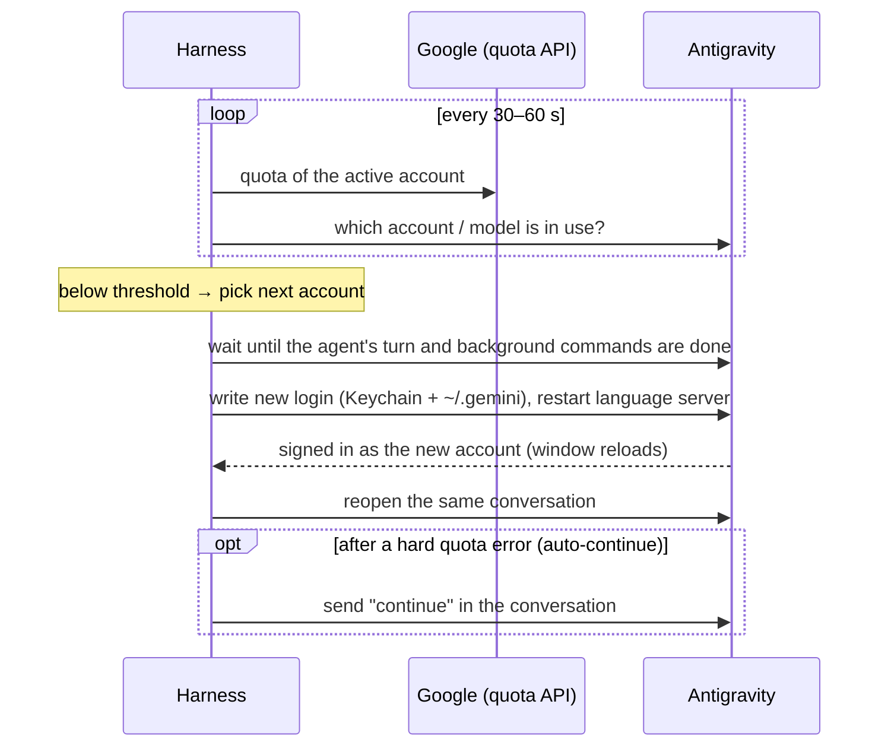

<p align="center">
  
</p>

<h1 align="center">Antigravity Harness</h1>

<p align="center">
  Keep <a href="https://antigravity.google">Google Antigravity</a> working across several of your own Google AI Pro accounts —
  switch accounts <b>before</b> a quota runs out, <b>between</b> tasks, without losing your conversation.
</p>

<p align="center">
  
  
  
  
</p>

> [!WARNING]
> **Unofficial project.** Not affiliated with, endorsed by or supported by Google. "Antigravity" and "Gemini" are trademarks of Google LLC.
> Rotating accounts to get around per-account usage limits may violate Google's terms of service and can get accounts restricted. Use only accounts you own, and use at your own risk.

---

## Why

Antigravity has weekly and 5-hour usage limits per account. When one runs out mid-project you have to log out, log in with another account and find your conversation again. Antigravity Harness does that for you: it watches the quota of every account, and when the one in use runs low it moves Antigravity to the best next account at a moment when no task is running, then reopens the conversation you were in.

## Features

- **Live quota tracking** – Gemini and Claude/GPT limits (weekly and 5-hour) for every account, with reset times.
- **Knows the real active account** – asks Antigravity which account it is signed into; the dashboard always matches the IDE.
- **Model aware** – detects whether your conversation uses Gemini or Claude/GPT and watches the right limits.
- **Smart Shield** – switches when the weekly or 5-hour quota drops below your thresholds; skips the switch when the low limit resets within 15 minutes.
- **Quota-efficient ordering** – spends the quota that would expire first ("use it or lose it"), or returns to your *main account* once it has recovered.
- **Never interrupts a task** – waits until the agent's turn is finished, including long-running background commands.
- **Keeps your conversation open** – after the switch the Antigravity window is moved back to the conversation you were in.
- **Auto-continue** (optional) – after a hard "quota reached" error it switches and asks the agent to continue.
- **Dashboard** – quotas, switch log, settings and a manual *Set Active* button at `http://127.0.0.1:8045`.
- **Zero dependencies** – plain Node.js (built-in `node:sqlite`, `fetch`, `WebSocket`).

## How it works



| Piece | What it does |
|---|---|
| Quota | Reads each account's buckets from Google's Cloud Code endpoints (all accounts every 3 min, the active one every 30–60 s). |
| Activity detection | Reads Antigravity's conversation logs (`~/.gemini/antigravity/brain/*/transcript.jsonl`) to know when a turn has finished and whether background commands are still running. |
| Switching | Writes the new account's OAuth tokens where Antigravity reads its login, then restarts Antigravity's language server; Antigravity respawns it signed in as the new account. |
| Conversation restore | Antigravity reloads its window at a blank conversation after the restart; the harness moves it back to `/c/<conversation-id>` through the local DevTools endpoint Antigravity opens itself. |

## Requirements

- macOS with the Antigravity desktop app
- Node.js **22 or newer**
- Two or more Google accounts with Antigravity access
- [PM2](https://pm2.keymetrics.io/) (recommended, keeps the harness running)

## Installation

```bash
git clone https://github.com/mushfiqnabiaz/Antigravity-Gateway.git antigravity-harness
cd antigravity-harness
cp oauth-client.example.json oauth-client.json
```

Fill in `oauth-client.json` with the OAuth client used to sign in the accounts. Antigravity refreshes the tokens itself after a switch, so they must be issued to an installed-app OAuth client that Antigravity accepts. This file is git-ignored; you can also use the `GOOGLE_OAUTH_CLIENT_ID` / `GOOGLE_OAUTH_CLIENT_SECRET` environment variables.

Add each account (a browser window opens for Google sign-in; tokens are stored in the git-ignored `accounts.json`):

```bash
npm run add-account
```

Start the harness:

```bash
pm2 start src/server.js --name antigravity-harness
pm2 save            # and `pm2 startup` once, to start it after a reboot
```

Or run it in the foreground with `npm start`. Open **http://127.0.0.1:8045**.

## Settings

All settings live in the dashboard's **Smart Quota Shield** panel (stored in `data/harness.db`):

| Setting | Default | Meaning |
|---|---|---|
| Switch when weekly / 5h below | 20% / 20% | Thresholds for leaving the current account. 15–25% leaves room for the running task to finish. |
| Watch limits of | Auto | Gemini, Claude/GPT, both, or the models the conversation is actually using. |
| Main account | none | Account to return to once its quota has recovered. Without one, the quota that expires soonest is used first. |
| Auto-continue after limit | off | After a hard quota error, switch and send a continue message to the conversation. Never overwrites a draft. |
| Auto-Switch | on | Turns Smart Shield on or off. Manual *Set Active* always works. |

## HTTP API

| Endpoint | Purpose |
|---|---|
| `GET /api/ide-status` | Account Antigravity is signed into, and any queued switch |
| `POST /api/set-active-account?id=<id>` | Switch now, or as soon as the current task finishes |
| `GET/POST /api/config/smart-shield` | Read / change Smart Shield settings |
| `POST /api/shield/test` | Simulate a quota error on the current account |
| `POST /api/ide-focus?id=<conversation>` | Open a conversation in the Antigravity window |
| `GET /api/stats`, `GET /health` | Quotas, usage and account state |
| `POST /v1/chat/completions`, `POST /v1/messages` | OpenAI / Anthropic compatible endpoints for other tools |

The server only listens on `127.0.0.1`, and POST requests coming from other websites are refused.

## Troubleshooting

| Problem | Fix |
|---|---|
| `EADDRINUSE: 127.0.0.1:8045` | Another copy is running (often under PM2). Use `npm run restart`. |
| Dashboard says "Antigravity not detected" | Make sure Antigravity is open. Switching depends on reading its login. |
| A switch stays "queued" | A task or background command (build, dev server) is still running. It happens when that finishes, or after 15 minutes without activity. |
| An account shows *403 Forbidden* | Google restricted the account; the harness stops using it. |

Note: the switch restarts Antigravity's language server, so anything the agent left running in the background (for example a dev server) stops at that moment.

## Development

```bash
npm test          # node:test, no dependencies
npm run restart   # reload the running harness after a change
```

```
src/
  server.js                  HTTP server, dashboard API, Smart Shield loop
  account-order.js           account ranking and Smart Shield decisions (pure, tested)
  antigravity-auth-sync.js   Antigravity login, restart scheduling, activity detection
  antigravity-window.js      DevTools control of the Antigravity window
  quota.js                   live quota from Google
  stats.js, db.js            usage statistics (SQLite)
  translator.js              OpenAI / Anthropic request translation
  dashboard.html             dashboard UI
scripts/
  restart.sh                 restart under PM2 or standalone
  build-native-app.sh        optional native macOS app (`npm run build:app`)
```

## Contributing

Issues and pull requests are welcome. Please:

- keep it dependency-free,
- add a test for decision logic (see `src/smart-shield.test.js`),
- never commit `accounts.json`, `oauth-client.json`, `stats.json` or `data/` — they hold tokens and usage data.

## License

[MIT](LICENSE) © Mushfiqur Rahaman
